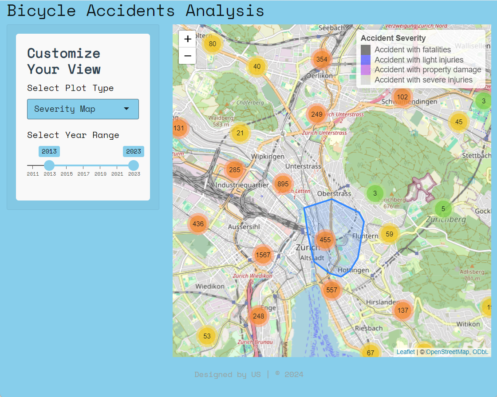

# Hackathon Cycling Dashboard

This dashboard was created for the Hackathon organized by the ETH-based association "Sports Analytics Club." Partners for this event included Swiss Cycling, Eviden AG, Veloforum, the City of Zurich, Traffic Division, and Kanton Zürich, Fachstelle Veloverkehr.

## Overview

The primary goal of this project was to explore how technology can be leveraged to address the rising number of (e)Bike accidents and to promote safe cycling practices in Zürich. 

## Bicycle Accident Analysis Dashboard

This Shiny application serves as an interactive tool for analyzing bicycle accident data in Zürich. It enables users to explore accident locations, visualize accident density through heatmaps, identify clusters of incidents, and evaluate the severity of accidents using various filters and visualization techniques.

The dashboard is particularly valuable for city administration, allowing them to identify and classify high-incident areas. By focusing on these locations, there is potential to enhance cycling safety throughout the city.

## Features

- **Heatmap Visualization:** 
  - Displays accident locations as a heatmap, helping to identify high-density accident areas.
  

- **Cluster Analysis:** 
  - Utilizes DBSCAN clustering to group accident locations, revealing areas with recurrent incidents.
   

- **Severity Mapping:** Visualize accident severity using color-coded markers to represent the severity of each incident.
  
  

- **User-Friendly Filters:** 
  - Allows users to customize views based on plot type, year range, and clustering parameters.

## Conclusion
This dashboard is designed to provide actionable insights for stakeholders interested in improving cycling safety in Zürich. By leveraging data visualization and analysis, we aim to contribute to a safer cycling environment for all.

## Installation

To run this application, ensure you have R installed along with the following packages:

```r
install.packages(c("shiny", "shinythemes", "leaflet", "leaflet.extras", "sf", "ggplot2", "dbscan", "dplyr", "bslib"))

